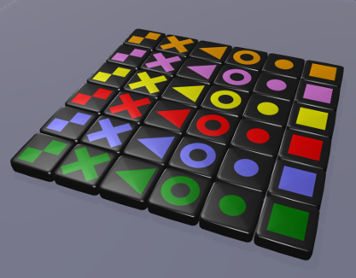

# SixPieces

SixPieces is a multiplayer online game based on the boardgame ["Qwirkle"](https://en.wikipedia.org/wiki/Qwirkle) by Susan McKinley Ross.

It is written in [TypeScript](https://www.typescriptlang.org/). Its graphical user interface is rendered in 3-D using [`babylon.js`](https://www.babylonjs.com/) with HTML5 and WebGL. It uses [`boardgame.io`](https://boardgame.io/), an open-source engine for turn-based games, to synchronize the game state between server and clients. 
Most of the coding was done end of 2020 to be able to play Qwirkle online. (There is another free implementation called [Pont](https://github.com/mkeeter/pont) by Matthew Keeter.)

## Start playing
[A demo server is running here.](https://zwo.uber.space/SixPieces/) Read below how to setup and play the game.

[](https://zwo.uber.space/SixPieces/)


## How to play
### Starting / joining a new game
Enter a new unique match ID to create a new game.
Other players can join (and rejoin) the game by using the same match ID. (No authentication is done. You can send a link to others to a particular match with the suffix `?matchID=`[your match ID] in the URL, e.g. [https://zwo.uber.space/SixPieces/?matchID=20210604](https://zwo.uber.space/SixPieces/?matchID=20210604). This will prefill the match ID in the game setup screen.)

### Actions in the game
Players take turns. 
There are 6 colors and 6 shapes.
Each piece exists 3 times.
Each player starts with 6 pieces on their hand, and draws new pieces to again have 6 at the end of the turn.
In each turn you can either place one to six pieces on the board or exchange one or more pieces from your hand with the bag.
Pan, move and zoom the field by using the mouse.
Place your pieces by clicking them and then clicking on the board.
When you have placed all pieces you want to play, press `e` to end your turn.
If pieces are highlighted in red, they cannot be placed here. You can only place pieces in one row or column, and mix either colors or shapes. 
To return pieces to the bag (swap), place them anywhere on the field as before and press `s`.
(For ending the turn or swapping pieces, there are also icons in the bottom right corner of the screen. This is particularly useful when playing on a screen-only device without a keyboard.)

For each piece in a valid row or column you get one point for each piece in that row or column. 
If you complete a row or column you get 6 bonus points. 
Also, if the bag is empty and you place the last piece from your hand, you get a final 6 bonus points.
This ends the game.
The player with the most points wins.
The current scores are shown in the document title.

### Keyboard shortcuts
* `e`: end your turn (place pieces on field)
* `s`: swap pieces (exchange pieces with bag)
* `c`: toggle between orthographic and perspective camera view
* `[space]`: move camera to view whole field
* `[return]`: move camera to view own pieces
* arrow keys or left-click: rotate and tilt view
* ctrl + arrow keys or right-click: pan view
* alt + up/down or wheel: zoom

For debugging:
* `[ctrl]+[shift]+x`: open babylon inspector to debug GUI

### Alternative pieces
Two different set of shapes are available, the original and an alternative which is meant to have simpler shapes that are easier to distinguish:




Which set should be displayed can be chosen under "Display options" when joining a game.

## Installation 
To run your own server or contribute to the development, follow these instructions.

Installation requires `npm`, the Node.js package manager, to be installed. To run do
```
npm install
npm start
```
If the installation (first step) was successful, the second step will open a web browser and navigate to `localhost:3000`.
Both take some time.

Note that npm7 takes offense with some dependencies. npm6 doesn't.

A standalone version that can run in (hopefully) any recent web browser can be be created with
```
npm build
```

The server is not included in this repository, although that should be possible in principle. Something on the [to-do list](TODO.md).
For local testing, run the server locally and set the server address (`server_url`) in [`index.html`](public/index.html) and the argument of `SocketIO` in [`index.ts`](src/index.ts).

### Playing in local mode
Not tested much. `multiplayer: Local()` does not yet work? Running without `multiplayer` works for debugging.

### Playing in server/client mode
This requires a server to be setup with [`SixPiecesServer`](https://github.com/fuenfundachtzig/SixPiecesServer/) that can be accessed from the web. 
Alternatively, server and clients can also be run on the same machine for testing. The server address is currently configured in `public/index.html`.  

### Contribute
Feel invited to improve the code and take a look at the [to-do list](TODO.md).

### License
[GNU General Public License version 3](https://opensource.org/licenses/GPL-3.0)
